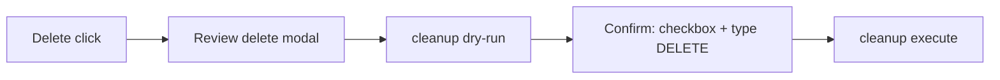

# Design: Protect disk images and confirm single deletes

**Change:** `protect-disk-images`

## Approach

Extend the existing safety layer with an extension-based disk-image guard, then reuse the cleanup dry-run/confirm modal for every single-path delete in the UI.

## Alternatives Considered

| Option | Pros | Cons | Decision |
|--------|------|------|----------|
| Hide disk images from Largest Files | No delete temptation | Hides useful space data | Rejected |
| Warning only, still deletable | Flexible | Still easy to destroy VMs | Rejected |
| Block extensions + confirm modal | Hard stop + clear UX | Two mechanisms | **Chosen** |

## Components

| Area | Change |
|------|--------|
| `internal/safety/disk_images.go` | `IsDiskImagePath`, `CanDeletePath` |
| `internal/api/handlers.go` | Delete uses `CanDeletePath`; annotate `largestFiles[].deletable` |
| `internal/api/cleanup.go` | Bulk cleanup skips disk images |
| `internal/insights/analyze.go` | Skip disk images in download/stale candidates |
| `web/src/main.ts` | Review → dry-run → confirm modal for single delete |

## Protected extensions

`.vhd`, `.vhdx`, `.avhd`, `.avhdx`, `.vmdk`, `.vdi`, `.qcow`, `.qcow2`, `.wim`, `.esd`, `.vfd`

## Single-delete UI flow

## Data & API Touchpoints

- `FileEntry.deletable` optional bool on scan GET
- Reuses `POST /api/scans/{id}/cleanup` for dry-run and execute (same confirmPhrase as bulk)
- Existing `POST /api/scans/{id}/delete` still blocked for disk images if called directly
